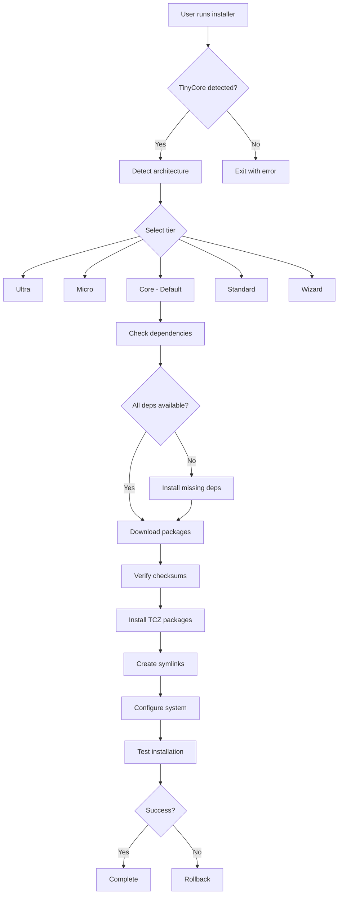

# TinyCore Linux Packaging Specification

**Date:** 2026-01-14  
**Target:** TinyCore Linux 15.x  
**Format:** TCZ (TinyCoreZip)

---

## 📋 Table of Contents

1. [TCZ Package Format](#tcz-package-format)
2. [Package Structure](#package-structure)
3. [Dependency System](#dependency-system)
4. [Installation Tiers](#installation-tiers)
5. [Build Process](#build-process)
6. [Testing Strategy](#testing-strategy)

---

## TCZ Package Format

### What is TCZ?

TCZ (TinyCoreZip) is TinyCore Linux's native package format. It's essentially:
- A **SquashFS filesystem** compressed with gzip
- Mounted as a loop device at runtime
- Read-only, union-mounted with the root filesystem

### Key Characteristics

- **Size:** Typically 1KB - 50MB (uDOS core ~5-10MB)
- **Compression:** gzip or xz
- **Format:** SquashFS 4.0+
- **Mount Point:** `/tmp/tcloop/<package_name>/`
- **Union Mount:** Files appear in root filesystem via aufs/overlay

### File Extensions

| Extension | Purpose |
|-----------|---------|
| `.tcz` | Main package (SquashFS) |
| `.tcz.dep` | Dependencies list |
| `.tcz.md5.txt` | MD5 checksum |
| `.tcz.info` | Package metadata |
| `.tcz.list` | File listing |
| `.tcz.zsync` | Delta sync (optional) |

---

## Package Structure

### uDOS Package Hierarchy

```
udos-core.tcz           # Base TUI system (required)
├── udos-api.tcz        # API server (optional)
├── udos-transport.tcz  # Network transports (optional)
├── udos-wizard.tcz     # Always-on server (optional)
└── udos-app.tcz        # Tauri desktop app (optional, separate)
```

### Core Package Contents

```
udos-core.tcz/
├── usr/
│   ├── local/
│   │   ├── bin/
│   │   │   ├── udos              # Main launcher
│   │   │   ├── upy               # uPY interpreter
│   │   │   └── udos-version      # Version checker
│   │   ├── lib/
│   │   │   └── udos/
│   │   │       ├── core/         # Python core
│   │   │       ├── knowledge/    # Knowledge bank
│   │   │       └── config/       # Default configs
│   │   └── share/
│   │       ├── doc/udos/         # Documentation
│   │       └── man/man1/         # Man pages
│   └── bin/
│       └── udos -> ../local/bin/udos
└── etc/
    └── udos/
        └── udos.conf             # System config
```

### File Locations (TinyCore Standard)

| Path | Purpose |
|------|---------|
| `/usr/local/bin/` | User executables |
| `/usr/local/lib/udos/` | Python modules |
| `/usr/local/share/doc/udos/` | Documentation |
| `/usr/local/share/man/` | Man pages |
| `/etc/udos/` | Configuration |
| `/home/tc/.udos/` | User data (not in TCZ) |

---

## Dependency System

### Core Dependencies

**udos-core.tcz.dep:**
```
python3.12.tcz
python3.12-setuptools.tcz
python3.12-pip.tcz
ncurses.tcz
readline.tcz
```

**udos-api.tcz.dep:**
```
udos-core.tcz
python3.12-flask.tcz
python3.12-websocket.tcz
```

**udos-wizard.tcz.dep:**
```
udos-core.tcz
udos-api.tcz
python3.12-requests.tcz
python3.12-yaml.tcz
git.tcz
openssh.tcz
```

### Dependency Resolution

TinyCore uses `tce-load` for dependency resolution:

```bash
# Install with dependencies
tce-load -wi udos-core.tcz

# Download only (no install)
tce-load -w udos-core.tcz

# Check dependencies
tce-load -i udos-core.tcz
```

---

## Installation Tiers

### Tier Definitions

| Tier | Size | Description | Packages |
|------|------|-------------|----------|
| **Ultra** | ~5MB | Minimal TUI only | udos-core |
| **Micro** | ~8MB | Core + local transports | udos-core, udos-transport |
| **Mini** | ~12MB | + API server | udos-core, udos-transport, udos-api |
| **Core** | ~15MB | Default installation | All above + basic knowledge |
| **Standard** | ~25MB | Full knowledge bank | Core + full knowledge |
| **Wizard** | ~35MB | Always-on server | Standard + udos-wizard |

### Installation Command

```bash
# Interactive installer
./install.sh

# Tier selection
./install.sh --tier=core

# Custom selection
./install.sh --packages="udos-core,udos-api"

# Check installation
udos --version
```

---

## Build Process

### 1. Create Package Directory Structure

```bash
#!/bin/bash
# build_tcz.sh

PACKAGE_NAME="udos-core"
BUILD_DIR="/tmp/udos-build"
PACKAGE_DIR="${BUILD_DIR}/${PACKAGE_NAME}"

# Create structure
mkdir -p ${PACKAGE_DIR}/usr/local/{bin,lib/udos,share/{doc/udos,man/man1}}
mkdir -p ${PACKAGE_DIR}/etc/udos

# Copy files
cp -r core/* ${PACKAGE_DIR}/usr/local/lib/udos/
cp scripts/udos ${PACKAGE_DIR}/usr/local/bin/
cp docs/* ${PACKAGE_DIR}/usr/local/share/doc/udos/
```

### 2. Create SquashFS Archive

```bash
# Build TCZ package
mksquashfs ${PACKAGE_DIR} ${PACKAGE_NAME}.tcz \
    -noappend \
    -comp gzip \
    -b 4K

# Verify
unsquashfs -l ${PACKAGE_NAME}.tcz
```

### 3. Generate Metadata Files

**udos-core.tcz.dep:**
```bash
cat > udos-core.tcz.dep << EOF
python3.12.tcz
ncurses.tcz
readline.tcz
EOF
```

**udos-core.tcz.info:**
```bash
cat > udos-core.tcz.info << EOF
Title:          udos-core.tcz
Description:    uDOS Core - Offline-first knowledge system
Version:        1.0.2.0
Author:         Fred Porter
Original-site:  https://github.com/fredpook/uDOS
Copying-policy: MIT
Size:           5.2M
Extension_by:   fredpook
Tags:           knowledge system offline python tui
Comments:       Core TUI system for uDOS
                Includes uPY interpreter and command system
Change-log:     2026-01-14 Initial TinyCore package
Current:        2026-01-14
EOF
```

**udos-core.tcz.md5.txt:**
```bash
md5sum udos-core.tcz > udos-core.tcz.md5.txt
```

**udos-core.tcz.list:**
```bash
unsquashfs -ll udos-core.tcz | awk '{print $NF}' > udos-core.tcz.list
```

### 4. Package Validation

```bash
# Check package structure
unsquashfs -l udos-core.tcz

# Verify MD5
md5sum -c udos-core.tcz.md5.txt

# Test load
sudo tce-load -i udos-core.tcz

# Verify installation
which udos
udos --version
```

---

## Testing Strategy

### Local VM Testing

```bash
# 1. Download TinyCore ISO
wget http://tinycorelinux.net/15.x/x86_64/release/CorePlus-15.0.iso

# 2. Create VM (VirtualBox/QEMU)
qemu-system-x86_64 \
    -cdrom CorePlus-15.0.iso \
    -m 1024 \
    -boot d

# 3. Copy TCZ packages
scp udos-*.tcz tc@tinycore:/tmp/

# 4. Install
tce-load -i /tmp/udos-core.tcz

# 5. Test
udos
```

### Automated Testing

```python
# tests/test_tinycore_package.py

def test_tcz_structure():
    """Verify TCZ has correct structure"""
    result = subprocess.run(['unsquashfs', '-l', 'udos-core.tcz'], 
                          capture_output=True)
    
    required_paths = [
        'usr/local/bin/udos',
        'usr/local/lib/udos/core/',
        'etc/udos/udos.conf',
    ]
    
    for path in required_paths:
        assert path in result.stdout.decode()

def test_dependencies():
    """Verify dependency file exists and is valid"""
    with open('udos-core.tcz.dep') as f:
        deps = f.read().strip().split('\n')
    
    assert 'python3.12.tcz' in deps
    assert 'ncurses.tcz' in deps
```

---

## Build Automation

### Makefile

```makefile
# Makefile for uDOS TCZ packages

PACKAGES = udos-core udos-api udos-transport udos-wizard
BUILD_DIR = distribution/build
RELEASE_DIR = distribution/release

.PHONY: all clean test

all: $(PACKAGES)

udos-core:
	@echo "Building udos-core.tcz..."
	@./scripts/build_tcz.sh core
	@md5sum $(BUILD_DIR)/udos-core.tcz > $(BUILD_DIR)/udos-core.tcz.md5.txt

udos-api:
	@echo "Building udos-api.tcz..."
	@./scripts/build_tcz.sh api

udos-transport:
	@echo "Building udos-transport.tcz..."
	@./scripts/build_tcz.sh transport

udos-wizard:
	@echo "Building udos-wizard.tcz..."
	@./scripts/build_tcz.sh wizard

clean:
	rm -rf $(BUILD_DIR)/*

test:
	pytest tests/test_tinycore_package.py -v

release: all
	cp $(BUILD_DIR)/udos-*.tcz* $(RELEASE_DIR)/
	@echo "Release packages ready in $(RELEASE_DIR)/"
```

---

## ISO Remastering

### Create Bootable ISO with uDOS

```bash
#!/bin/bash
# remaster_iso.sh

ISO_INPUT="CorePlus-15.0.iso"
ISO_OUTPUT="uDOS-TinyCore-15.0.iso"
MOUNT_DIR="/mnt/tinycore"
EXTRACT_DIR="/tmp/tinycore-extract"

# Extract ISO
mkdir -p ${EXTRACT_DIR}
sudo mount -o loop ${ISO_INPUT} ${MOUNT_DIR}
cp -a ${MOUNT_DIR}/* ${EXTRACT_DIR}/
sudo umount ${MOUNT_DIR}

# Add uDOS packages
mkdir -p ${EXTRACT_DIR}/cde/optional
cp distribution/release/udos-*.tcz ${EXTRACT_DIR}/cde/optional/

# Add to onboot.lst (auto-install core)
echo "udos-core.tcz" >> ${EXTRACT_DIR}/cde/onboot.lst

# Rebuild ISO
mkisofs -l -J -R -V "uDOS-TinyCore" \
    -no-emul-boot -boot-load-size 4 -boot-info-table \
    -b boot/isolinux/isolinux.bin \
    -c boot/isolinux/boot.cat \
    -o ${ISO_OUTPUT} ${EXTRACT_DIR}

# Make hybrid (USB bootable)
isohybrid ${ISO_OUTPUT}

echo "Bootable ISO created: ${ISO_OUTPUT}"
```

---

## Package Repository Structure

### Local Repository

```
/mnt/udos-repo/
├── 15.x/
│   ├── x86/
│   │   ├── tcz/
│   │   │   ├── udos-core.tcz
│   │   │   ├── udos-core.tcz.dep
│   │   │   ├── udos-core.tcz.info
│   │   │   ├── udos-core.tcz.md5.txt
│   │   │   └── udos-core.tcz.list
│   │   └── CHECKSUMS.md5
│   └── x86_64/
│       └── tcz/
│           └── (same structure)
└── info.txt
```

### Remote Repository

Host on GitHub releases or dedicated server:

```
https://udos.example.com/tcz/15.x/x86_64/
```

Configure TinyCore to use custom repo:

```bash
# /opt/tcemirror
https://udos.example.com/tcz/
```

---

## Installation Workflow



---

## Next Steps

1. ✅ Understand TCZ format
2. 🔄 Build TCZ builder script
3. 📦 Create udos-core.tcz
4. 📦 Create extension packages
5. 🔧 Build installer
6. 🧪 Test on TinyCore VM
7. 📚 Complete documentation

---

*Last Updated: 2026-01-14*  
*Next: Build TCZ builder infrastructure*
